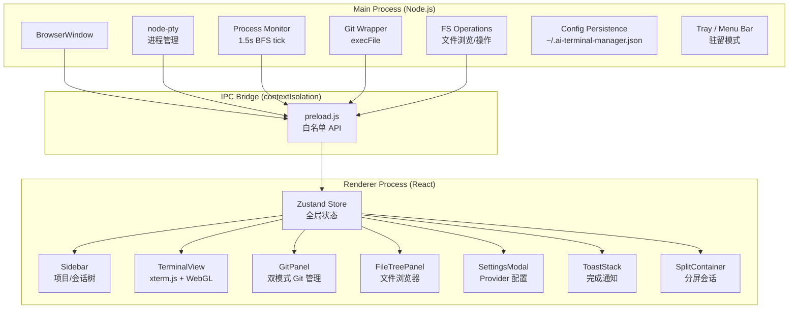

# CLAUDE.md

This file provides guidance to Claude Code (claude.ai/code) when working with code in this repository.

# 智枢 ZhiShu - AI Terminal Manager

> 多 Agent AI 编程终端统一指挥台。在一个桌面应用内管理 Claude Code / Codex / Gemini CLI / Qwen / OpenCode / GLM / MiniMax / Kimi 等 8 款 AI CLI 工具。

**技术栈**: Electron 31 + React 18 + xterm.js (WebGL) + Zustand + node-pty
**平台**: macOS (当前唯一支持)
**协议**: MIT | **作者**: Xuuuuu04

---

## 常用命令

```bash
npm start                 # 开发模式 (React dev server + Electron)
npm test                  # 运行所有测试 (Node.js 内置 test runner)
npm run package           # 生产构建 (.dmg/.zip/.app)
npm run verify:desktop    # 验证打包链路（不产完整安装包）
npm run rebuild-native    # 重编译 node-pty（Electron 版本更新后必须）
```

运行单个测试文件：

```bash
node --test electron/gitStatus.test.js
node --test electron/monitor.test.js
node --test electron/tools.test.js
node --test electron/config.test.js
node --test electron/keychain.test.js
node --test electron/pathValidator.test.js
node --test src/store/sessionState.test.js
```

---

## 架构总览



## 模块索引

| 模块 | 路径 | 职责 | 详情 |
|------|------|------|------|
| **主进程** | `electron/` | pty 管理、进程监控、Git/FS 操作、Tray | [electron/CLAUDE.md](electron/CLAUDE.md) |
| **渲染进程** | `src/` | React UI、Zustand 状态管理、xterm.js 终端 | [src/CLAUDE.md](src/CLAUDE.md) |
| **CI/CD** | `.github/workflows/` | GitHub Actions：测试 + 原生模块重编译 + 桌面包包验证 | ci.yml |
| **构建资产** | `build-assets/` | SVG 图标源文件 → .icns | BUILD.md |
| **构建文档** | `BUILD.md` | 图标工作流、打包配置、Gatekeeper 绕过 | BUILD.md |

## 全局开发规范

### 进程边界
- **所有** pty / 文件系统 / git 操作必须在 Main 进程，Renderer 只通过 `window.electronAPI` (IPC) 调用
- `contextIsolation: true` + `nodeIntegration: false` — 不在 Renderer 中直接使用 Node.js API
- 新增 IPC handler 时必须在 `preload.js` 同步暴露

### 安全
- 命令执行一律用 `execFile`（参数数组），禁止 `exec` / `shell=True`（防 CWE-78）
- 文件路径不允许用户控制完整路径（`newName` 必须是 basename，防 CWE-22）
- Provider API Key 存储在 `~/.ai-terminal-manager.json` 中脱敏为 `***`，真实密钥通过 macOS Keychain 存取

### 状态管理
- **唯一状态源**: `src/store/sessions.js` (Zustand store)
- 纯函数抽取到 `src/store/sessionState.js`（可独立测试）
- 持久化到 `~/.ai-terminal-manager.json`，通过 `persist()` 方法显式触发

### 进程监控状态机
```
not_started → idle_no_instruction → running → awaiting_review
     ↑              ↑                 ↑              │
     └──────────────┴─────────────────┴──────────────┘
```
- `not_started`: 无 AI 进程
- `idle_no_instruction`: AI 已启动，用户未发指令
- `running`: 用户已发指令，AI 正在输出（静默 < 3s）
- `awaiting_review`: AI 输出静默 > 3s → debounce 3.5s → 发通知

### Provider 系统
GLM / MiniMax / Kimi 复用 Claude 二进制 + 环境变量注入（`ANTHROPIC_BASE_URL`）：
- `sessionLaunchedTool` Map 区分 "声明意图" vs `ps` 检测结果
- POSIX 单引号转义：`'` → `'\''`
- Provider 配置合并：用户覆盖 (`providerConfigs`) + 目录默认值 (`PROVIDER_CATALOG.defaults`)

### 会话自动恢复
- 启动时读取每个 session 的 `lastTool` → 延迟 1.2s 注入 `--continue` 命令
- `autoRestoreSessions` 开关控制（默认开启）

### pty 生命周期
- React 18 strict mode 会 double-mount useEffect → `createPty` 必须 reuse 已有 pty
- 删除 session 时 `killPtyTree` 递归 SIGKILL 整个进程树（不只是 SIGHUP shell）
- `collectDescendants` 用同步 `execFileSync`（before-quit 不可 await）

### 测试
- 运行: `npm test`（Node.js 内置 test runner）
- 测试文件: `electron/gitStatus.test.js`, `electron/monitor.test.js`, `electron/tools.test.js`, `electron/config.test.js`, `electron/keychain.test.js`, `electron/pathValidator.test.js`, `src/store/sessionState.test.js`
- 仅纯函数和可 mock 的模块可测（Main 进程的 pty/Git 依赖 Node.js 运行时，Renderer 依赖 DOM）

### 关键技术决策
1. **Electron 而非 Tauri**: node-pty 是 Node native addon，Tauri (Rust) 需重写整个 pty 层
2. **Zustand 而非 Redux**: 无 Provider / boilerplate，适合中等复杂度桌面应用
3. **`ps -axo` BFS 而非 pgrep 循环**: 单次快照 + 内存 BFS 比多次 shell-out 高效 10 倍
4. **通知 debounce 3.5s**: 避免 tool-call 暂停（1-3s）误触发完成通知
5. **ImageAddon 禁用**: xterm.js #4793 dispose race condition，等上游修复
6. **WebGL addon 单独 dispose**: 时序敏感，不走 AddonManager 批量 dispose
7. **窗口状态持久化**: `main.js` 保存/恢复窗口 bounds 和 maximized 状态，防止外接显示器断开后窗口飞出可视区域
8. **分屏 (SplitContainer)**: 同一项目下可左右/上下分屏并排显示两个会话，ratio 可调，通过 Zustand `splitPane` 状态驱动
9. **Stop Hook 精确通知 (hookWatcher)**: 通过 Claude Code Stop hook 写 sentinel 文件 + fs.watch 即时检测，比轮询 debounce 更精确
10. **TODO AI 助手**: 内置 AI TODO 管理，通过 Anthropic-format 流式 API 多轮对话，支持 tool_use 循环

## 项目结构

```
ai-terminal-manager/
├── electron/
│   ├── main.js            # 应用入口：生命周期 + 窗口 + 模块组装
│   ├── preload.js         # IPC 安全桥
│   ├── pty.js             # PTY 生命周期、共享状态、进程清理
│   ├── monitor.js         # 进程监控 FSM（1.5s BFS tick）
│   ├── git.js             # Git IPC handlers
│   ├── fs-handlers.js     # 文件系统 IPC handlers
│   ├── tray.js            # macOS 菜单栏驻留
│   ├── tools.js           # 工具目录 + 安装 IPC handlers
│   ├── config.js          # 配置持久化 + Keychain 迁移
│   ├── gitStatus.js       # git status --porcelain 解析器（纯函数）
│   ├── keychain.js        # macOS Keychain 集成
│   ├── pathValidator.js   # 文件路径验证
│   ├── hookWatcher.js     # Claude Code Stop hook 精确完成通知
│   ├── todoAI.js          # AI TODO 助手流式 API
│   ├── gitStatus.test.js
│   ├── monitor.test.js
│   ├── tools.test.js
│   ├── config.test.js
│   ├── keychain.test.js
│   ├── pathValidator.test.js
│   └── fsImportExternal.test.js
├── src/
│   ├── index.js           # 入口，字体导入，全局 CSS 变量
│   ├── App.jsx            # 根组件，快捷键，Toast/Modal 挂载
│   ├── store/
│   │   ├── sessions.js    # Zustand store
│   │   ├── sessionState.js    # 纯函数抽取（可独立测试）
│   │   └── sessionState.test.js
│   ├── constants/
│   │   └── toolVisuals.js # 工具/Provider 视觉元数据单一真源
│   ├── components/
│   │   ├── Sidebar.jsx        # 项目树 + 会话列表 + 统计
│   │   ├── TerminalView.jsx   # xterm 终端 + 工具栏 + 状态条
│   │   ├── SplitContainer.jsx # 分屏容器（v1.2.0）
│   │   ├── GitPanel.jsx       # Git 管理
│   │   ├── FileTreePanel.jsx  # 文件浏览器 + 拖拽到终端
│   │   ├── FilePreviewPanel.jsx # 文件预览（图片/MD/文本）
│   │   ├── SettingsModal.jsx  # 设置窗口
│   │   ├── ContextMenu.jsx    # 通用右键菜单 (Portal)
│   │   ├── PromptDialog.jsx   # 自定义 prompt 对话框
│   │   ├── PromptTemplate.jsx # Prompt 模板面板（v1.2.0）
│   │   ├── CommandPalette.jsx # Cmd+P 快速启动面板
│   │   ├── BroadcastBar.jsx   # 多终端广播输入栏
│   │   ├── TodoPanel.jsx      # TODO 管理面板
│   │   ├── TodoAIChat.jsx     # AI TODO 助手聊天
│   │   ├── ToastStack.jsx     # 响应完成 toast
│   │   ├── ToolIcons.jsx      # 手绘 SVG 图标集
│   │   └── ErrorBoundary.jsx  # 渲染错误边界
│   └── utils/
│       └── sound.js       # Web Audio 合成提示音
├── .github/workflows/ci.yml
├── BUILD.md
├── README.md
├── package.json
└── build-assets/
    └── icon.svg
```

---

*Updated: 2026-04-17 -- v1.2.x hookWatcher, todoAI, CommandPalette, FilePreview, TodoPanel, BroadcastBar, toolVisuals*
