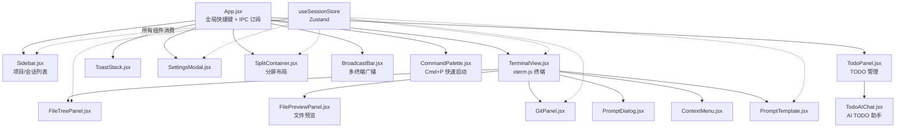

# src/ - Renderer Process

> [← 返回根目录](../CLAUDE.md)

Electron 渲染进程模块。React 18 SPA，Zustand 状态管理，xterm.js WebGL 终端渲染。

---

## 文件清单

| 文件 | 职责 |
|------|------|
| `index.js` | 入口：字体导入 (Inter + JetBrains Mono)、全局 CSS 变量、drag-drop guard、ReactDOM 挂载 |
| `App.jsx` | 根组件：全局快捷键 (Cmd+T/W/1-9)、IPC 订阅、Toast/Modal 挂载、终端堆叠/分屏布局 |
| `store/sessions.js` | Zustand store：项目/会话 CRUD、Provider 配置、工具状态、Toast、设置、分屏状态 |
| `store/sessionState.js` | 纯函数抽取（可独立测试）：session 查找、项目操作、主题解析 |
| `components/TerminalView.jsx` | xterm.js 终端 + 工具栏 + 状态条 + 文件拖拽 + 搜索栏 + Prompt 模板按钮 |
| `components/SplitContainer.jsx` | 分屏容器：左右/上下分割两个会话，ratio 可拖拽调整 |
| `components/Sidebar.jsx` | 项目树 + 会话列表 + 统计 + 添加项目/模板菜单 |
| `components/GitPanel.jsx` | Git 面板（当前仓库模式 + 多仓库扫描模式） |
| `components/FileTreePanel.jsx` | 文件浏览器（懒加载、git 着色、右键菜单、拖拽到终端） |
| `components/SettingsModal.jsx` | 设置窗口（Provider 配置、工具安装状态、主题、自动恢复） |
| `components/ContextMenu.jsx` | 通用右键菜单（Portal 渲染，避免 transform 包含块问题） |
| `components/PromptDialog.jsx` | 自定义 prompt 对话框（Promise-based，替代被 Electron 阻止的 window.prompt） |
| `components/PromptTemplate.jsx` | Prompt 模板选择/管理面板（内置模板 + 用户自定义） |
| `components/ToastStack.jsx` | 响应完成 toast 通知（右侧浮层） |
| `components/ToolIcons.jsx` | 手绘 SVG 图标集（每个工具/Provider 专属品牌色图标） |
| `components/ErrorBoundary.jsx` | 渲染错误边界 |
| `components/BroadcastBar.jsx` | 多终端广播输入栏（broadcastMode 激活时底部显示，文字发送到所有 pty） |
| `components/CommandPalette.jsx` | Cmd+P 快速启动面板（会话切换 + 操作列表） |
| `components/FilePreviewPanel.jsx` | 文件预览面板（图片/Markdown/纯文本/二进制回退/大文件回退） |
| `components/TodoPanel.jsx` | TODO 管理面板（优先级、截止日期、分组、筛选） |
| `components/TodoAIChat.jsx` | AI TODO 助手聊天（多轮对话，tool_use 循环，流式输出） |
| `constants/toolVisuals.js` | 工具/Provider 视觉元数据单一真源（品牌色、标签、glow、排序） |
| `utils/sound.js` | Web Audio API 合成双音提示音（A5→E6，无音频文件依赖） |

## Zustand Store 结构 (`sessions.js`)

### 状态字段
| 字段 | 类型 | 说明 |
|------|------|------|
| `projects` | `Array<{ id, name, path, sessions }>` | 项目列表，每个项目含会话数组 |
| `activeSessionId` | `string \| null` | 当前激活的会话 ID |
| `sessionStatus` | `Object<sessionId, status>` | 实时进程状态（从 Main 进程 IPC 推送） |
| `toolCatalog` | `{ tools, providers }` | 工具目录（从 Main 进程获取） |
| `toolStatus` | `Object<toolId, { installed, version }>` | 工具安装状态 |
| `providerConfigs` | `Object<providerId, config>` | 用户 Provider 配置覆盖 |
| `yoloMode` | `boolean` | 全局 YOLO 模式开关 |
| `notificationsEnabled` | `boolean` | 桌面通知开关 |
| `autoRestoreSessions` | `boolean` | 自动恢复上次会话 |
| `alwaysOnTop` | `boolean` | 窗口置顶 |
| `theme` | `'dark' \| 'light'` | 当前主题（light 尚未完整实现） |
| `sidebarWidth` | `number` | 侧边栏宽度（180-420px 可拖拽调整） |
| `fileTreeOpen` / `gitPanelOpen` | `boolean` | 右侧面板互斥开关 |
| `settingsOpen` | `boolean` | 设置模态框开关 |
| `toasts` | `Array` | 当前活跃的 toast 通知 |
| `promptDialog` | `Object \| null` | 当前活跃的 prompt 对话框 |
| `splitPane` | `{ sessionId, direction, ratio } \| null` | 分屏状态：主会话 ID + 方向 + 比例 |
| `promptTemplates` | `Array<{ id, title, content, builtIn }>` | Prompt 模板列表 |
| `todos` | `Array<{ id, text, done, priority, createdAt, doneAt, dueDate }>` | TODO 项列表（含优先级、截止日期） |
| `broadcastMode` | `boolean` | 多终端广播模式（输入同时发送所有 pty） |
| `commandPaletteOpen` | `boolean` | Cmd+P 命令面板开关 |
| `filePreviewPath` | `string \| null` | 当前预览文件路径 |

### 关键方法
| 方法 | 说明 |
|------|------|
| `init()` | 启动引导：加载配置 + 工具目录 + 探测工具安装 |
| `persist()` | 持久化到 `~/.ai-terminal-manager.json` |
| `updateSessionStatus(id, status)` | 接收 Main 进程状态推送，同步 lastTool |
| `createProjectFromTemplate(id, path, name)` | 从模板创建项目（写入 memory 文件） |
| `syncSessionNamesToMain()` | 推送友好名到 Main 进程（通知用） |
| `showPrompt({ title, defaultValue })` | Promise-based 自定义 prompt |
| `getEffectiveProvider(id)` | 合并用户配置 + 目录默认值 |
| `splitSession(sessionId, direction)` | 开启分屏：当前会话为主，项目内下一个会话为副 |
| `closeSplit()` | 关闭分屏 |
| `setSplitRatio(ratio)` | 调整分屏比例 |
| `addPromptTemplate(title, content)` | 添加自定义 prompt 模板 |
| `addTodo(text, priority?, dueDate?)` | 添加 TODO 项 |
| `updateTodo(id, updates)` | 更新 TODO 项（优先级、截止日期等） |
| `deleteTodo(id)` | 删除 TODO 项 |
| `toggleTodo(id)` | 切换 TODO 完成状态 |
| `clearDoneTodos()` | 清除已完成的 TODO 项 |
| `toggleBroadcastMode()` | 切换多终端广播模式 |
| `disableBroadcastMode()` | 关闭广播模式 |

### 项目模板 (`PROJECT_TEMPLATES`)
| ID | 名称 | 会话 | Memory 文件 |
|----|------|------|-------------|
| `blank` | 空项目 | 1 | 无 |
| `single-claude` | Claude 单会话 | 1 | CLAUDE.md |
| `fullstack` | 全栈开发 | 2 (Frontend/Backend) | CLAUDE.md + AGENTS.md |
| `multi-ai` | 多 AI 对比 | 3 (Claude/Gemini/Codex) | CLAUDE.md + GEMINI.md + AGENTS.md + QWEN.md |

## 组件数据流

## 终端堆叠/分屏架构 (App.jsx)

### 非分屏模式
所有会话的 TerminalView **同时挂载**，通过 `visibility: hidden/visible` + `z-index` 切换：
- 不可用 `display: none`（会破坏 xterm FitAddon 的尺寸计算）
- 所有 pty 进程保持活跃，后台会话继续运行 AI 工具

### 分屏模式 (SplitContainer)
- `primaryId`: 左侧/顶部会话（当前激活会话）
- `secondaryId`: 右侧/底部会话（同一项目内下一个会话）
- `direction`: `horizontal` (左右) 或 `vertical` (上下)
- `ratio`: 0.2 ~ 0.8，通过 divider 拖拽调整
- 分屏时 App.jsx 渲染 `SplitContainer` 替代单个 `TerminalView`

## 工具/Provider 视觉定义 (`constants/toolVisuals.js`)

单一真源文件，导出 `TOOL_VISUALS` / `TOOL_COLORS` / `TOOL_LABELS` / `TOOL_ORDER` / `PROVIDER_ORDER` / `PHASE_STANDBY` / `PHASE_REVIEW`。所有组件从此文件导入，不再各自定义。

| 工具 | 品牌色 | glow 色 |
|------|--------|---------|
| Claude | `#d97706` | amber |
| Codex | `#16a34a` | green |
| Gemini | `#3b82f6` | blue |
| Qwen | `#06b6d4` | cyan |
| OpenCode | `#f97316` | orange |
| GLM | `#a855f7` | purple |
| MiniMax | `#ec4899` | pink |
| Kimi | `#0ea5e9` | sky blue |
| QwenCP | `#0d9488` | teal |

## CSS 主题变量 (index.js)

通过 `data-theme` 属性切换：
- `--bg-root`, `--bg-sidebar`, `--bg-main`, `--bg-toolbar`, `--bg-card`
- `--border-base`
- `--text-primary`, `--text-secondary`, `--text-tertiary`, `--text-mute`
- `--font-ui` (Inter), `--font-mono` (JetBrains Mono)

## 依赖

### 运行时
- `react` (^18.2.0), `react-dom` (^18.2.0)
- `zustand` (^4.5.0) — 状态管理
- `uuid` (^9.0.0) — 会话/项目 ID 生成
- `react-markdown` — Markdown 渲染（FilePreviewPanel + TodoAIChat）
- `@xterm/xterm` (^5.5.0) — 终端模拟器
- `@xterm/addon-fit` — 自适应尺寸
- `@xterm/addon-webgl` — GPU 渲染
- `@xterm/addon-search` — 终端内搜索
- `@xterm/addon-unicode11` — 宽字符支持
- `@xterm/addon-web-links` — 可点击 URL
- `@fontsource/inter`, `@fontsource/jetbrains-mono` — 打包字体

### 开发时
- `react-scripts` (5.0.1) — Create React App

## 已知限制 / TODO
- Light 主题未完整实现（`resolveTheme` 强制返回 dark）
- ImageAddon 因 xterm.js #4793 禁用
- 仅 macOS 测试通过

---

*Updated: 2026-04-17 -- v1.2.x CommandPalette, FilePreview, TodoPanel, BroadcastBar, TodoAIChat, toolVisuals*
